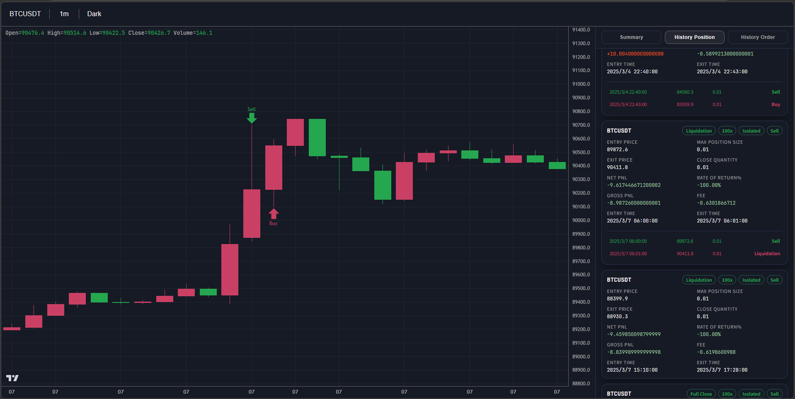

# trading-maid

[中文](../README.md) | English

[](https://crates.io/crates/trading-maid)
[](https://docs.rs/trading-maid)
[](https://github.com/86maid/trading-maid)
[](https://opensource.org/licenses/Apache-2.0)

trading-maid is a backtesting and live-trading framework for crypto futures, with a strong focus on behavior close to real exchanges.
It includes key mechanics such as matching, slippage, leverage, margin, and liquidation for strategy validation, iteration, and live integration.

> ⚡ Keywords: high-fidelity matching / two-stage trigger orders / margin and liquidation mechanics / backtest visualization



## Contents

- [✨ Core Capabilities](#-core-capabilities)
- [🧭 Trading Model and Constraints](#-trading-model-and-constraints)
- [🏗️ Architecture Overview](#-architecture-overview)
- [🚀 Quick Start](#-quick-start)
- [🧠 Context](#-context)
- [📈 Indicators](#-indicators)
- [🚦 Hook Intercept](#-hook-intercept)
- [🧪 A Complete Example](#-a-complete-example)

## ✨ Core Capabilities

- Backtesting environment close to live trading: simulates exchange matching logic to reduce backtest/live deviation.
- Live exchange abstraction: provides a unified exchange interface for smooth migration from backtest to live trading.
- Indicator and series tools: includes common technical indicators and time-series processing utilities.
- Backtest result visualization: render candlesticks, orders, and position history in a web page.

## 🧭 Trading Model and Constraints

### 🧾 Order Types

- Supported: trigger price + (limit | market)
- Not supported: OCO (take-profit/stop-loss combo order)

### 📦 Position Type

- Margin mode: isolated
- Position direction: one-way
- Margin asset type: single-currency margin
- Margin management: dynamically adjusts position margin

### ⚙️ Order Processing Logic

- Margin freeze: market orders freeze margin when filled; reduce-only orders do not freeze margin.
- Matching timing: an order is placed on the current k-line and matched on the next k-line.
- Fill rules: market orders fill at `Open`; limit orders follow these rules:
    - Long
        - limit >= market: fill at worst price `High`
        - limit < market: fill at limit price
    - Short
        - limit <= market: fill at worst price `Low`
        - limit > market: fill at limit price
- Priority: when both pending-order conditions and liquidation conditions are met, pending orders are executed first.
- Fees: market orders use `taker_fee`; limit and liquidation orders use `maker_fee`.

## 🏗️ Architecture Overview

For the full text diagram, see [architecture.txt](architecture.txt).

## 🚀 Quick Start

### 📥 Installation

Using `cargo add`

```bash
cargo add trading-maid
```

Or in `Cargo.toml`

```toml
[dependencies]
trading-maid = "1.0.0"
```

### 🛠️ Usage

```rust
use trading_maid::prelude::*;

// Open a short position when a long upper shadow appears.
async fn my_strategy(cx: &Context<'_>) -> anyhow::Result<()> {
    let body = (cx.open - cx.close).abs();
    let line = (cx.high - cx.open).abs();
    let cond = cx.open > cx.close && line >= body * 2.0 && body >= 300.0;

    if cx.get_position("BTCUSDT").await?.is_none() && cond {
        println!("place order: {}", t2s(cx.time));

        let tp = cx.open - line;
        let sp = cx.open + line;

        cx.cancel_all_order("BTCUSDT").await?;
        cx.sell("BTCUSDT", 0.01).await?;
        cx.buy_limit_reduce_only("BTCUSDT", tp, 0.01).await?;
        cx.buy_trigger_market_reduce_only("BTCUSDT", sp, 0.01)
            .await?;
    }

    Ok(())
}

#[tokio::main]
async fn main() {
    // Download the latest 12 months of 1-minute-level data.
    let path = get_or_download("BTCUSDT/1m", 12).await.unwrap();

    let data_source_1m = DataSource::from_file_metadata(
        path,
        Metadata {
            symbol: "BTCUSDT".to_string(),
            level: Level::Minute1,
            min_size: 0.01,
            min_notional: 0.0,
            tick_size: 0.1,
            maker_fee: 0.0002,
            taker_fee: 0.0005,
            maintenance: 0.004,
        },
    )
    .unwrap();

    let exchange = LocalExchange::new(data_source_1m.clone())
        .cash(10000.0)
        .leverage(10)
        .slippage(0.0);

    let mut engine = Engine::new(exchange.clone(), my_strategy);

    // Backtest with 1-minute data, but call the strategy whenever each 1-hour k-line is generated.
    if let Err(v) = engine.run("BTCUSDT", Level::Hour1).await {
        println!("{:#?}", v);
    }

    let history_position = exchange.get_history_position_list("BTCUSDT").await.unwrap();
    let history_order = exchange.get_history_order_list("BTCUSDT").await.unwrap();
    let summary = summarize(&history_position);

    println!("history summary: {:#?}", summary);

    // Resample 1-minute data into 1-hour data.
    let data_source_1h = data_source_1m.resample(Level::Hour1).unwrap();

    open_in_browser(
        [data_source_1h, data_source_1m],
        history_position,
        history_order,
    )
    .unwrap();
}
```

In this example, we set:

* minimum order size (min_size): 0.01
* minimum notional (min_notional): 0.0 = no restriction
* price tick size (tick_size): 0.1
* maker fee (maker_fee): 0.0002
* taker fee (taker_fee): 0.0005
* maintenance margin rate (maintenance): 0.004
* cash: 10000
* leverage: 10
* slippage: 0

The backtest runs on 1-minute data while the strategy runs on 1-hour k-lines. The engine calls the strategy at each 1-hour k-line close (the last minute of each hour), and every k-line observed by the strategy is 1-hour-level.

Although other levels can be used, you should always use 1-minute data as the backtest source to achieve high-precision results.

Use `cargo run -r` to run backtests faster.

## 🧠 Context

In `Context`, `time`, `open`, `high`, `low`, and `close` are of type `&Series`, which is essentially a wrapped slice.

You can use `cx.close[0]` for the current k-line close, `cx.close[1]` for the previous k-line close, and so on.

You can use `cx.close[2..]` to get a slice.

This type also overloads many operators, so you can omit index `[0]` in calculations, for example `cx.close + 100`.

You can destructure `Context` for easier OHLC usage.

```rust
async fn my_strategy(
    Context {
        time,
        open,
        high,
        low,
        close,
        volume,
        exchange,
    }: &Context<'_>,
) -> anyhow::Result<()> {
    println!("time: {}", t2s(time));
    Ok(())
}
```

## 📈 Indicators

Some commonly used indicators are built into `indicator`.

```rust
async fn my_strategy(cx: &Context<'_>) -> anyhow::Result<()> {
    highest(cx.high, 7);
    ma(cx.close, 30);
    ema(cx.close, 144);
    Ok(())
}
```

Calling `ema` directly may lead to slow backtests and incorrect calculations, because EMA depends on the previous EMA value. So it is recommended to use `EMACache` for fast and accurate calculation.

Use `EMACache::with_ema` to create an instance with an initial EMA value.


## 🚦 Hook Intercept

You can use `hook` to stop backtesting when a position is liquidated or an order is rejected (insufficient balance).

```rust
async fn my_hook(_: KLine, exchange: Arc<dyn Exchange + 'static>) -> anyhow::Result<()> {
    if let Some(v) = exchange
        .get_history_order_list("BTCUSDT")
        .await?
        .iter()
        .find(|v| v.status == Status::Rejected || v.kind == Kind::Liquidation)
    {
        anyhow::bail!(
            "rejected/liquidation {}: cash: {}",
            t2s(v.update_time),
            exchange.get_cash().await?
        );
    }

    Ok(())
}

let mut engine = Engine::new(exchange.clone(), MyStrategy::new());

engine.hook(my_hook);

if let Err(v) = engine.run("BTCUSDT", Level::Minute5).await {
    println!("{:#?}", v);
}
```

## 🧪 A Complete Example

```rust
use std::sync::Arc;
use trading_maid::prelude::*;

struct MyStrategy {
    ema_cache144: EMACache,
    ema_cache169: EMACache,
    count: usize,
}

impl MyStrategy {
    pub fn new() -> Self {
        MyStrategy {
            ema_cache144: EMACache::with_ema(144, 80871.2),
            ema_cache169: EMACache::with_ema(169, 78705.2),
            count: 0,
        }
    }
}

#[async_trait(?Send)]
impl Strategy for MyStrategy {
    // If the close stays below EMA for 50 consecutive k-lines and the current close breaks above EMA, open a short.
    async fn next(&mut self, cx: &Context) -> anyhow::Result<()> {
        let ema144 = self.ema_cache144.update(cx.close);
        let ema169 = self.ema_cache169.update(cx.close);

        if self.count >= 50
            && (cx.close >= ema144 || cx.close >= ema169)
            && cx.get_position("BTCUSDT").await?.is_none()
        {
            println!("place_order: {}", t2s(cx.time));

            cx.cancel_all_order("BTCUSDT").await?;
            cx.sell("BTCUSDT", 0.01).await?;
            cx.buy_limit_reduce_only("BTCUSDT", cx.close - 1000.0, 0.01)
                .await?;
            cx.buy_trigger_market_reduce_only("BTCUSDT", cx.close + 1000.0, 0.01)
                .await?;
        }

        if cx.close <= ema144 && cx.close <= ema169 {
            self.count += 1;
        } else {
            self.count = 0;
        }

        Ok(())
    }
}

// Stop backtesting when liquidation happens or an order is rejected (insufficient balance).
async fn my_hook(_: KLine, exchange: Arc<dyn Exchange + 'static>) -> anyhow::Result<()> {
    if let Some(v) = exchange
        .get_history_order_list("BTCUSDT")
        .await?
        .iter()
        .find(|v| v.status == Status::Rejected || v.kind == Kind::Liquidation)
    {
        anyhow::bail!(
            "rejected/liquidation {}: cash: {}",
            t2s(v.update_time),
            exchange.get_cash().await?
        );
    }

    Ok(())
}

#[tokio::main]
async fn main() {
    let path = get_or_download("BTCUSDT/1m", 12).await.unwrap();

    let data_source_1m = DataSource::from_file_metadata(
        path,
        Metadata {
            symbol: "BTCUSDT".to_string(),
            level: Level::Minute1,
            min_size: 0.01,
            min_notional: 0.0,
            tick_size: 0.1,
            maker_fee: 0.0002,
            taker_fee: 0.0005,
            maintenance: 0.004,
        },
    )
    .unwrap();

    let exchange = LocalExchange::new(data_source_1m.clone())
        .cash(10000.0)
        .leverage(10)
        .slippage(0.0);

    let mut engine = Engine::new(exchange.clone(), MyStrategy::new());

    engine.hook(my_hook);

    if let Err(v) = engine.run("BTCUSDT", Level::Minute5).await {
        println!("{:#?}", v);
    }

    let history_position = exchange.get_history_position_list("BTCUSDT").await.unwrap();
    let history_order = exchange.get_history_order_list("BTCUSDT").await.unwrap();
    let summary = summarize(&history_position);

    println!("history summary: {:#?}", summary);

    let data_source_5m = data_source_1m.resample(Level::Minute5).unwrap();
    let data_source_1h = data_source_1m.resample(Level::Hour1).unwrap();

    open_in_browser(
        [data_source_5m, data_source_1m, data_source_1h],
        history_position,
        history_order,
    )
    .unwrap();
}
```
