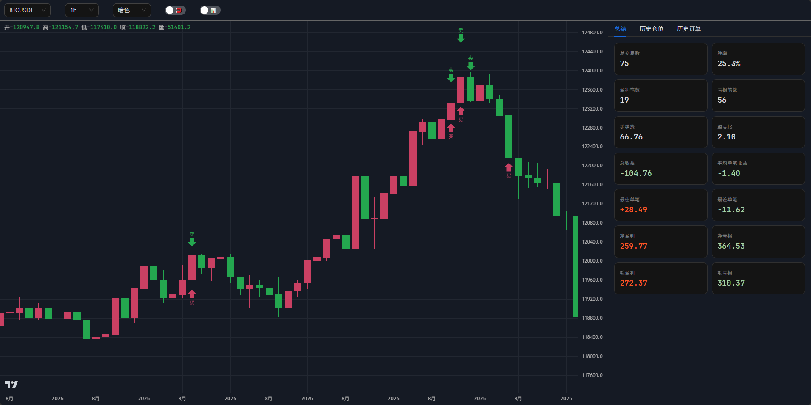

# trading-maid

[English](README.md)  | 中文

[](https://crates.io/crates/trading-maid)
[](https://docs.rs/trading-maid)
[](https://github.com/86maid/trading-maid)
[](https://opensource.org/licenses/Apache-2.0)

> ⚡ 关键词：高拟真撮合 / 双阶段触发单 / 保证金与强平机制 / 回测可视化

trading-maid 是一个面向加密货币合约交易的回测与实盘框架，重点是尽量贴近真实交易环境。

框架内置撮合、滑点、杠杆、保证金与强平等关键机制，可用于策略验证、迭代和实盘接入。



## 目录

- [✨ 核心能力](#-核心能力)
- [🧭 交易模型与限制](#-交易模型与限制)
- [🏗️ 架构概览](#-架构概览)
- [🚀 快速开始](#-快速开始)
- [⚡ 快速回测](#-快速回测)
- [🧠 Context](#-context)
- [📊 Series](#-series)
- [📈 指标](#-指标)
- [🧩 策略 Struct](#-策略-struct)
- [🛑 错误处理](#-错误处理)
- [🚦 Hook 劫持](#-hook-劫持)
- [📊 自定义系列](#-自定义系列)
- [🔄 获取其他级别的数据](#-获取其他级别的数据)
- [🌐 多币种策略](#-多币种策略)
- [🧪 EMA 策略例子](#-ema-策略例子)
- [📊 影线反转策略](#-影线反转策略--candle-wick-reversal使用内置指标)
- [📊 成交量突破策略](#-成交量突破策略--donchian--volume-spike自实现指标)
- [📊 动量突破策略](#-动量突破策略--price-action自实现指标)
- [📊 RSI EMA 突破策略](#-rsi-ema-突破策略--consecutive-candle-breakout使用内置指标)

## ✨ 核心能力

- **贴近实盘的回测环境**：模拟交易所撮合逻辑，内置**滑点**、**杠杆**、**保证金**与**强制平仓**机制，降低回测与实盘偏差。
- **实盘接口抽象**：支持统一的交易所接口，便于从回测迁移到实盘。
- **指标与序列工具**：提供常用技术指标与时间序列处理能力。
- **回测结果可视化**：可将 K 线、订单与持仓历史以网页形式展示。

## 🧭 交易模型与限制

### 🧾 订单类型

- 支持：触发价 + (限价 | 市价)
- 不支持：OCO（止盈止损组合单）

### 📦 仓位类型

- 保证金模式：逐仓
- 持仓方向：单向持仓
- 保证金类型：单币种保证金
- 保证金管理：动态调整仓位保证金

### ⚙️ 订单处理逻辑

- 保证金冻结：市价单在成交时冻结保证金，只减仓订单不冻结保证金。
- 撮合时序：下单会在当前 K 线挂单，在下一根 K 线撮合，触发单触发后会立即在当前 K 线撮合一次。
- 成交规则：市价单使用 Open 作为市价成交，限价单分为以下几种情况：
    - 多单
        - 委托价 >= 市价：以最坏的价格 High 成交
        - 委托价 < 市价：以委托价格成交
    - 空单
        - 委托价 <= 市价：以最坏的价格 Low 成交
        - 委托价 > 市价：以委托价格成交
- 优先级：当挂单条件与强平条件同时满足时，挂单优先执行。
- 手续费：市价单使用 taker_fee，限价单和强平单使用 maker_fee。

## 🏗️ 架构概览

完整文字架构图见 [architecture.txt](architecture.txt)。

## 🚀 快速开始

### 📥 安装

使用 `cargo add`

```bash
cargo add trading-maid
```

或者 `Cargo.toml`

```toml
[dependencies]
trading-maid = "1"
```

### 🛠️ 使用

```rust
use trading_maid::prelude::*;

// 出现长上影线时开空单
async fn my_strategy(cx: &Context<'_>) -> anyhow::Result<()> {
    let body_size = (cx.open - cx.close).abs();
    let upper_shadow_size = (cx.high - cx.open).abs();
    let open_short_condition =
        cx.open > cx.close && upper_shadow_size >= body_size * 2 && body_size >= 300;

    if cx.get_position("BTCUSDT").await?.is_none() && open_short_condition {
        println!("place order: {}", t2s(cx.time));

        let take_profit_price = cx.open - upper_shadow_size;
        let stop_price = cx.open + upper_shadow_size;

        cx.cancel_all_order("BTCUSDT").await?;

        _ = cx
            .sell_tp_sl("BTCUSDT", take_profit_price, stop_price, "0.01")
            .await?;
    }

    Ok(())
}

#[tokio::main]
async fn main() {
    // 下载最近 12 个月的 1 分钟级别数据
    let path = get_or_download("BTCUSDT/1m", 12).await.unwrap();

    let data_source_1m = DataSource::from_file_metadata(
        path,
        Metadata {
            symbol: "BTCUSDT".to_string(),
            level: Level::Minute1,
            min_size: "0.01".parse().unwrap(),
            min_notional: "0".parse().unwrap(),
            tick_size: "0.1".parse().unwrap(),
            maker_fee: "0.0002".parse().unwrap(),
            taker_fee: "0.0005".parse().unwrap(),
            maintenance: "0.004".parse().unwrap(),
        },
    )
    .unwrap();

    let exchange = LocalExchange::new(data_source_1m.clone())
        .unwrap()
        .cash(10000)
        .leverage(10)
        .slippage(0);

    let mut engine = Engine::new(exchange.clone(), my_strategy);

    // 使用 1 分钟级别数据进行回测，但在每个 1 小时级别的 K 线生成时都会调用策略函数
    if let Err(v) = engine.run("BTCUSDT", Level::Hour1).await {
        println!("error: {:#?}", v);
    }

    let history_position = exchange.get_history_position_list("BTCUSDT").await.unwrap();
    let history_order = exchange.get_history_order_list("BTCUSDT").await.unwrap();
    let summary = summarize(&history_position);

    println!("history summary: {:#?}", summary);

    // 从 1 分钟级别数据重采样得到 1 小时级别数据
    let data_source_1h = data_source_1m.resample(Level::Hour1).unwrap();

    // 传入多个时间级别，方便在可视化页面中切换查看。
    open_in_server(
        [data_source_1h, data_source_1m],
        history_position,
        history_order,
    )
    .await
    .unwrap();
}
```

在这个例子中，我们设置了

* 最小下单数量 (min_size) 0.01
* 最小名义价值 (min_notional) 0.0 = 无限制
* 价格变化精度 (tick_size) 0.1
* 挂单费率 (maker_fee) 0.0002
* 吃单费率 (taker_fee) 0.0005
* 维持保证金率 (maintenance) 0.004
* 现金 (cash)  = 10000  
* 杠杆 (leverage) = 10  
* 滑点 (slippage) = 0

**回测为 1 分钟级别，策略为 1 小时级别**，回测引擎会在 1 小时级别的 k 线收盘时（一小时的最后一分钟）调用策略，策略获取到的每一根 k 线都是 1 小时级别的。

虽然可以使用其他级别，但是应 **始终使用 1 分钟级别的数据进行回测**，这样可以获得高精度的结果。

`open_in_server` 会启动一个本地服务器并自动在浏览器中打开回测可视化页面。

推荐优先使用 `open_in_server` 而非 `open_in_browser`，后者会每次都把 K 线数据写入文件导致浏览器重新加载，浪费时间。

使用 `cargo run -r` 能更快的完成回测。

> ⚠️ 注意：`sell_tp_sl` 只是语法糖，并非真正的 OCO 订单（框架不支持 OCO），它仅仅是同时下了两张单，需要你自己在开新仓前调用 `cancel_all_order` 来取消旧单。

> ⚠️ **止损注意**：止损应该使用触发单，例如，市价做多后的止损应使用 `sell_trigger_market_reduce_only`（价格到达触发价后执行只减仓市价卖出），市价做空后的止损应使用 `buy_trigger_market_reduce_only`（价格到达触发价后执行只减仓市价买入）。不要用 `sell_limit_reduce_only` 或 `buy_limit_reduce_only`——在订单簿中，卖出限价低于市价（或买入限价高于市价）意味着你的挂单直接穿过了买卖价差，会立刻成交，止损单就变成了即时市价出场，而不是等价格跌到止损位再触发。简单说，你的限价单会立即以市价成交。此外，止损务必使用 `reduce_only`，否则可能导致仓位反向持仓。

> ⚠️ **精度警告**：创建订单时（如 `buy`、`sell`、`buy_limit`、`sell_tp_sl` 等），价格和数量参数接受 `impl TryInto<Decimal>`。为避免浮点数精度丢失，对于高精度的数值，应使用字符串形式传入（如 `"0.01"`），而不是使用 `f64` 字面量如 `0.01`。

## ⚡ 快速回测

如果你想要用合理的预设配置快速回测，可以使用 `backtest()` 函数——它会自动处理数据下载、交易所设置和引擎创建，一行代码搞定：

```rust
use trading_maid::prelude::*;

// 出现长上影线时开空单
async fn my_strategy(cx: &Context<'_>) -> anyhow::Result<()> {
    let body_size = (cx.open - cx.close).abs();
    let upper_shadow_size = (cx.high - cx.open).abs();
    let open_short_condition =
        cx.open > cx.close && upper_shadow_size >= body_size * 2 && body_size >= 300;

    if cx.get_position("BTCUSDT").await?.is_none() && open_short_condition {
        println!("place order: {}", t2s(cx.time));

        let take_profit_price = cx.open - upper_shadow_size;
        let stop_price = cx.open + upper_shadow_size;

        cx.cancel_all_order("BTCUSDT").await?;

        _ = cx
            .sell_tp_sl("BTCUSDT", take_profit_price, stop_price, "0.01")
            .await?;
    }

    Ok(())
}

#[tokio::main]
async fn main() {
    let result = backtest("BTCUSDT", 12, my_strategy, Level::Hour1)
        .await
        .unwrap();

    // 回测结果汇总
    println!("summary: {:#?}", result.summarize());

    // 数据重采样到所有级别后可视化
    result.resample_all_open_in_server().await.unwrap();
}
```

`backtest()` 使用以下预设配置：

* **数据源**：1 分钟级别（自动通过 `get_or_download` 下载）
* **Metadata**：min_size=0.01、min_notional=0、tick_size=0.1、maker_fee=0.0002、taker_fee=0.0005、maintenance=0.004
* **交易所**：cash=1,000,000、leverage=1、slippage=0

### BacktestResult API

返回的 `BacktestResult` 提供以下方法：

| 方法 | 说明 |
|--------|-------------|
| `summarize()` | 返回 `HistoryPositionSummary`，包含胜率、盈亏、总交易次数等关键指标 |
| `open_in_browser()` | 将可视化写入临时 HTML 文件并在默认浏览器中打开 |
| `open_in_server()` | 启动本地服务器，以策略级别数据进行可视化 |
| `resample_all_open_in_server()` | 启动本地服务器，数据重采样到所有兼容级别，方便切换查看 |

> 💡 **这是懒人方法**——适合快速策略原型验证和实验。如果需要完全控制费率、杠杆、滑点、现金等参数，请使用[快速开始](#-快速开始)中的手动设置方式。

## 🧠 Context

在 `Context` 中，`time, open, high, low, close` 的类型为 `&Series`，这实际上是一个封装的切片。

你可以使用 `cx.close[0]` 表示当前 k 线的收盘价，`cx.close[1]` 表示上一根 k 线的收盘价，以此类推。 

你可以使用 `&cx.close[2..]` 来获取一个切片。

该类型还重载了大量的运算符，在计算时候可以省略下标 `[0]`，例如 `cx.close + 100`。

你可以将 `Context` 展开，以方便使用 OHLCV。

```rust
async fn my_strategy(
    Context {
        time,
        open,
        high,
        low,
        close,
        volume,
        exchange,
        series,
    }: &Context<'_>,
) -> anyhow::Result<()> {
    println!("time: {}", t2s(time));
    Ok(())
}
```

## 📊 Series

`Series` 是 `Context` 中贯穿始终的核心数值类型。它封装了一个倒序切片——`series[0]` 是当前 K 线，`series[1]` 是上一根，以此类推。越界索引返回 `Decimal::MAX`。

`Series` 重载了大量运算符，可以写出自然的表达式：

```rust
// 算术运算——自动省略 [0]
cx.close + 100;
cx.high - cx.low;
cx.close * dec!(1.5);

// 比较——直接与数字或字符串比较
cx.close == 123;
cx.close > 123.456;
cx.close < "0.0005";

// 切片——返回 &Series
&cx.close[2..];     // 从 2 根前到最早
&cx.close[..5];     // 最近 5 根
&cx.close[2..5];    // 指定范围
```

> ⚠️ **精度警告：** 避免使用 `f64` 字面量——应使用字符串（`"123.456"`）或 `dec!` 宏，以防止浮点数精度丢失。

## 📈 指标

在 `indicator` 中内置了一些常用的指标。

```rust
async fn my_strategy(cx: &Context<'_>) -> anyhow::Result<()> {
    highest(cx.high, 7);
    ma(cx.close, 30);
    ema(cx.close, 144);
    Ok(())
}
```

直接调用 `ema` 函数可能导致回测缓慢和计算错误，因为计算 `ema` 需要用到上一个 `ema` 的值，所以推荐使用 `EMACache` 来进行快速和精确的计算。

使用 `EMACache::with_ema` 可以创建一个带有初始值的实例，然后在每根 K 线调用 `EMACache::update` 更新并获取当前值：

```rust
async fn next(&mut self, cx: &Context) -> anyhow::Result<()> {
    let Some(ema144) = self.ema_cache144.update(cx.close) else {
        return Ok(());
    };
    
    Ok(())
}
```

## 🧩 策略 Struct

当策略需要维护状态（如缓存、计数器等）时，可以用 struct 实现 `Strategy` trait。

```rust
struct MyStrategy {
    ema_cache: EMACache,
    count: usize,
}

#[async_trait(?Send)]
impl Strategy for MyStrategy {
    async fn next(&mut self, cx: &Context) -> anyhow::Result<()> {
        // 使用 self.ema_cache, self.count ...
        Ok(())
    }
}

let mut engine = Engine::new(exchange.clone(), MyStrategy::new());
```

## 🛑 错误处理

使用 `on_error` 来处理策略返回的错误。如果不设置，引擎会在策略出错时立即停止。

```rust
let mut engine = Engine::new(exchange.clone(), MyStrategy::new());

engine.on_error(|err| {
    eprintln!("策略错误: {:#?}", err);
    Ok(()) // 返回 Ok 继续运行，返回 Err 停止回测
});

if let Err(v) = engine.run("BTCUSDT", Level::Hour1).await {
    println!("{:#?}", v);
}
```

## 🚦 Hook 劫持

使用 `hook` 可以在仓位发生强平，或者订单被拒绝（余额不足）的时候停止回测。

引擎在每根 K 线执行完策略后都会调用 hook 函数。

```rust
async fn my_hook(_: KLine, exchange: Arc<dyn Exchange + 'static>) -> anyhow::Result<()> {
    if let Some(v) = exchange
        .get_history_order_list("BTCUSDT")
        .await?
        .iter()
        .find(|v| v.status == Status::Rejected || v.kind == Kind::Liquidation)
    {
        anyhow::bail!(
            "rejected/liquidation {}: cash: {}",
            t2s(v.update_time),
            exchange.get_cash().await?
        );
    }

    Ok(())
}

let mut engine = Engine::new(exchange.clone(), MyStrategy::new());

engine.hook(my_hook);

if let Err(v) = engine.run("BTCUSDT", Level::Minute5).await {
    println!("{:#?}", v);
}
```

## 📊 自定义系列

使用 `add_series` 将自定义数据（资金费率、链上指标、情绪等）附加到引擎。注册后，系列会与 OHLCV 数据同步，并可在策略中通过 `cx["name"]` 访问。

### 对齐自定义数据

自定义数据通常以稀疏的 `(时间戳毫秒, 值)` 形式存在。使用 `align_to_series` 将其前向填充为对齐到目标 K 线级别的 `AlignedSeries`：

```rust
// 稀疏的自定义数据：(时间戳毫秒, 值)
let custom_data = vec![
    (1717200000000, "1.5".parse::<Decimal>().unwrap()),
    (1717286400000, "2.3".parse::<Decimal>().unwrap()),
];

// 前向填充对齐到 1 小时 K 线
let series = align_to_series(&custom_data, Level::Hour1).unwrap();

// 在调用 run() 之前注册到引擎
let mut engine = Engine::new(exchange, my_strategy);
engine.add_series("BTCUSDT", "custom_metric", series);
engine.run("BTCUSDT", Level::Hour1).await?;
```

### 资金费率示例

`get_or_download_funding_rate_to_series` 可下载 Binance 历史资金费率并自动对齐：

```rust
let funding_rate_series = get_or_download_funding_rate_to_series(
    "BTCUSDT", 12, Level::Hour1,
).await.unwrap();

engine.add_series("BTCUSDT", "funding_rate", funding_rate_series);
engine.run("BTCUSDT", Level::Hour1).await?;
```

### 在策略中访问

在策略中按名称读取附加系列：

```rust
async fn my_strategy(cx: &Context<'_>) -> anyhow::Result<()> {
    if cx["funding_rate"] != &[] {
        // 当前 K 线的资金费率
        let fr = cx["funding_rate"][0];
        // 上一根 K 线
        let fr_prev = cx["funding_rate"][1];

        // 费率过高时避免做多
        if fr > "0.0005" {
            return Ok(());
        }
    }

    Ok(())
}
```

如果给定的 symbol/level/name 没有注册系列，`cx[name]` 会返回空系列（可通过 `== []` 判断）。

## 🔄 获取其他级别的数据

使用 `cx.request()` 可以获取某个交易对在**指定级别**的 OHLCV 上下文。

```rust
// 获取 BTCUSDT 在 5 分钟级别的数据
if let Some(btc_5m_cx) = cx.request("BTCUSDT", Level::Minute5) {
    let ma_30 = ma(btc_5m_cx.close, 30);
}
```

`request` 背后通过**重采样**（resample）实现：

- 如果请求的级别等于**策略级别**（`engine.run` 传入的级别）或**源数据级别**（DataSource 的级别），直接返回预构建好的数据，无额外开销。
- 如果请求其他级别，框架会从源 K 线数据重采样到目标级别，**首次访问时计算并缓存**，同一根 K 线内后续调用直接命中缓存，不会重复计算。

目标级别必须是源数据级别的整数倍，你可以使用 `is_valid_sampling_target` 判断是否兼容。

> ⚠️ **推荐：始终使用 1 分钟数据作为源数据**，这样可以重采样到任意级别，获得最大的灵活性。

## 🌐 多币种策略

同时运行多个交易对的策略。向 `run()` 传入交易对数组，通过 `cx.request()` 访问其他交易对的 OHLCV 数据：

```rust
let exchange = LocalExchange::new([btc_data, eth_data])?;

let mut engine = Engine::new(exchange, my_strategy);

// 向 run() 传入多个交易对
engine.run(["BTCUSDT", "ETHUSDT"], Level::Hour1).await?;
```

在策略中，通过 `cx.request()` 访问其他交易对的上下文：

```rust
async fn my_strategy(cx: &Context<'_>) -> anyhow::Result<()> {
    // 直接访问 BTCUSDT（主交易对）
    let ma_val = ma(cx.close, 30);

    // 通过 request 访问 ETHUSDT
    if let Some(eth_cx) = cx.request("ETHUSDT", Level::Hour1) {
        // 像普通 Context 一样使用 eth_cx
        let ma_val = ma(eth_cx.close, 30);
    }
    
    Ok(())
}
```

> ⚠️ **注意：** 所有币种必须使用相同的级别，且数据时间范围必须有交集——只有当所有币种在当前 K 线都有数据时，策略才会触发。
>
> ⚠️ **注意：** 回测引擎会并发调用每个币种的 `next`。

## 🧪 EMA 策略例子

```rust
use std::sync::Arc;
use trading_maid::prelude::*;

struct MyStrategy {
    ema_cache144: EMACache,
    ema_cache169: EMACache,
    count: usize,
}

impl MyStrategy {
    pub fn new() -> Self {
        MyStrategy {
            ema_cache144: EMACache::with_ema(144, 80871),
            ema_cache169: EMACache::with_ema(169, 78705),
            count: 0,
        }
    }
}

#[async_trait(?Send)]
impl Strategy for MyStrategy {
    // 如果连续 50 根 K 线收盘价都在 EMA 之下，且当前 K 线收盘价突破 EMA，则开空单
    async fn next(&mut self, cx: &Context) -> anyhow::Result<()> {
        let Some(ema144) = self.ema_cache144.update(cx.close) else {
            return Ok(());
        };

        let Some(ema169) = self.ema_cache169.update(cx.close) else {
            return Ok(());
        };

        if self.count >= 50
            && (cx.close >= ema144 || cx.close >= ema169)
            && cx.get_position("BTCUSDT").await?.is_none()
        {
            println!("place_order: {}", t2s(cx.time));

            cx.cancel_all_order("BTCUSDT").await?;

            _ = cx
                .sell_tp_sl("BTCUSDT", cx.close - 1000, cx.close + 1000, "0.01")
                .await?;
        }

        if cx.close <= ema144 && cx.close <= ema169 {
            self.count += 1;
        } else {
            self.count = 0;
        }

        Ok(())
    }
}

// 仓位发生强平，或者订单被拒绝（余额不足）的时候停止回测
async fn my_hook(_: KLine, exchange: Arc<dyn Exchange + 'static>) -> anyhow::Result<()> {
    if let Some(v) = exchange
        .get_history_order_list("BTCUSDT")
        .await?
        .iter()
        .find(|v| v.status == Status::Rejected || v.kind == Kind::Liquidation)
    {
        anyhow::bail!(
            "rejected/liquidation {}: cash: {}",
            t2s(v.update_time),
            exchange.get_cash().await?
        );
    }

    Ok(())
}

#[tokio::main]
async fn main() {
    let path = get_or_download("BTCUSDT/1m", 12).await.unwrap();

    let data_source_1m = DataSource::from_file_metadata(
        path,
        Metadata {
            symbol: "BTCUSDT".to_string(),
            level: Level::Minute1,
            min_size: "0.01".parse().unwrap(),
            min_notional: "0".parse().unwrap(),
            tick_size: "0.1".parse().unwrap(),
            maker_fee: "0.0002".parse().unwrap(),
            taker_fee: "0.0005".parse().unwrap(),
            maintenance: "0.004".parse().unwrap(),
        },
    )
    .unwrap();

    let exchange = LocalExchange::new(data_source_1m.clone())
        .unwrap()
        .cash(10000)
        .leverage(10)
        .slippage(0);

    let mut engine = Engine::new(exchange.clone(), MyStrategy::new());

    engine.hook(my_hook);

    if let Err(v) = engine.run("BTCUSDT", Level::Minute5).await {
        println!("error: {:#?}", v);
    }

    let history_position = exchange.get_history_position_list("BTCUSDT").await.unwrap();
    let history_order = exchange.get_history_order_list("BTCUSDT").await.unwrap();
    let summary = summarize(&history_position);

    println!("history summary: {:#?}", summary);

    let data_source_5m = data_source_1m.resample(Level::Minute5).unwrap();
    let data_source_1h = data_source_1m.resample(Level::Hour1).unwrap();

    open_in_server(
        [data_source_5m, data_source_1m, data_source_1h],
        history_position,
        history_order,
    )
    .await
    .unwrap();
}
```

### 📊 影线反转策略 — Candle Wick Reversal（使用内置指标）

均值回归策略，当 4 小时 K 线出现长上影线（拒绝上涨）或长下影线（支撑确认）时开仓。仅使用了内置的 `atr()`。

```rust
use trading_maid::prelude::*;

fn round_to_tick(price: Decimal) -> Decimal {
    let tick = dec!(0.1);
    let rounded = (price / tick).round_dp(0) * tick;
    if rounded <= Decimal::ZERO {
        tick
    } else {
        rounded
    }
}

async fn my_strategy(cx: &Context<'_>) -> anyhow::Result<()> {
    if cx.close.len() < 50 {
        return Ok(());
    }

    let atr_val = atr(cx.high, cx.low, cx.close, 14);
    let Some(atr) = atr_val else { return Ok(()) };

    if cx.get_position("BTCUSDT").await?.is_some() {
        return Ok(());
    }

    let body = (cx.open[0] - cx.close[0]).abs();

    // 长上影线做空：上影线 >= 实体 2 倍
    let upper_shadow = cx.high[0] - cx.open[0].max(cx.close[0]);
    if cx.close[0] < cx.open[0] && upper_shadow >= body * dec!(2) && body >= dec!(200) {
        let sl = round_to_tick(cx.high[0] + atr * dec!(0.5));
        let tp = round_to_tick(cx.low[0] - atr * dec!(3));
        cx.cancel_all_order("BTCUSDT").await?;
        _ = cx.sell_tp_sl("BTCUSDT", tp, sl, "0.01").await?;
        return Ok(());
    }

    // 长下影线做多：下影线 >= 实体 2 倍
    let lower_shadow = cx.open[0].min(cx.close[0]) - cx.low[0];
    if cx.close[0] > cx.open[0] && lower_shadow >= body * dec!(2) && body >= dec!(200) {
        let sl = round_to_tick(cx.low[0] - atr * dec!(0.5));
        let tp = round_to_tick(cx.high[0] + atr * dec!(3));
        cx.cancel_all_order("BTCUSDT").await?;
        _ = cx.buy_tp_sl("BTCUSDT", tp, sl, "0.01").await?;
    }

    Ok(())
}

#[tokio::main]
async fn main() {
    let result = backtest("BTCUSDT", 12, my_strategy, Level::Hour4)
        .await
        .unwrap();

    println!("summary: {:#?}", result.summarize());
}
```

### 📊 回调趋势策略 — SMA + ATR + RSI（使用内置指标）

趋势跟踪策略，在大趋势方向（SMA50/200）上寻找回调入场。使用 `atr()` 计算止损，`rsi()` 过滤超买超卖。

```rust
use std::collections::VecDeque;
use trading_maid::prelude::*;

fn round_to_tick(price: Decimal) -> Decimal {
    let tick = dec!(0.1);
    let rounded = (price / tick).round_dp(0) * tick;
    if rounded <= Decimal::ZERO {
        tick
    } else {
        rounded
    }
}

struct PullbackStrategy {
    high_buf: VecDeque<Decimal>,
    low_buf: VecDeque<Decimal>,
}

impl PullbackStrategy {
    fn new() -> Self {
        PullbackStrategy {
            high_buf: VecDeque::new(),
            low_buf: VecDeque::new(),
        }
    }
}

#[async_trait(?Send)]
impl Strategy for PullbackStrategy {
    async fn next(&mut self, cx: &Context) -> anyhow::Result<()> {
        self.high_buf.push_front(cx.high[0]);
        self.low_buf.push_front(cx.low[0]);

        if self.high_buf.len() < 30 {
            return Ok(());
        }

        let sma50 = ma(cx.close, 50);
        let sma200 = ma(cx.close, 200);
        let atr_val = atr(cx.high, cx.low, cx.close, 14);
        let rsi_val = rsi(cx.close, 14);
        let (Some(sma50), Some(sma200), Some(_atr), Some(rsi)) = (sma50, sma200, atr_val, rsi_val)
        else {
            return Ok(());
        };

        if cx.get_position("BTCUSDT").await?.is_some() {
            return Ok(());
        }

        let low: Vec<Decimal> = self.low_buf.iter().copied().collect();
        let high: Vec<Decimal> = self.high_buf.iter().copied().collect();

        // 仅在趋势方向交易
        if sma50 > sma200 {
            let near_sma50 = cx.low[0] <= sma50 * dec!(1.005) && cx.low[0] >= sma50 * dec!(0.99);
            let recent_low = low.iter().take(5).copied().fold(Decimal::MAX, Decimal::min);

            if near_sma50 && cx.close[0] > cx.open[0] && rsi > dec!(40) && rsi < dec!(65) {
                let sl = round_to_tick(recent_low.min(cx.low[0]));
                let tp = round_to_tick(cx.close[0] + (cx.close[0] - sl) * dec!(2));
                cx.cancel_all_order("BTCUSDT").await?;
                _ = cx.buy_tp_sl("BTCUSDT", tp, sl, "0.01").await?;
                return Ok(());
            }
        }

        if sma50 < sma200 {
            let near_sma50 = cx.high[0] >= sma50 * dec!(0.99) && cx.high[0] <= sma50 * dec!(1.005);
            let recent_high = high
                .iter()
                .take(5)
                .copied()
                .fold(Decimal::MIN, Decimal::max);

            if near_sma50 && cx.close[0] < cx.open[0] && rsi > dec!(35) && rsi < dec!(60) {
                let sl = round_to_tick(recent_high.max(cx.high[0]));
                let tp = round_to_tick(cx.close[0] - (sl - cx.close[0]) * dec!(2));
                cx.cancel_all_order("BTCUSDT").await?;
                _ = cx.sell_tp_sl("BTCUSDT", tp, sl, "0.01").await?;
            }
        }

        Ok(())
    }
}

#[tokio::main]
async fn main() {
    let result = backtest("BTCUSDT", 12, PullbackStrategy::new(), Level::Hour4)
        .await
        .unwrap();

    println!("summary: {:#?}", result.summarize());
}
```

### 📊 成交量突破策略 — Donchian + Volume Spike（自实现指标）

完全从零实现**唐奇安通道**、**成交量比率**和**RMA 平滑均线**。价格放量突破 20 周期唐奇安通道时入场。

```rust
use std::collections::VecDeque;
use trading_maid::prelude::*;

fn round_to_tick(price: Decimal) -> Decimal {
    let tick = dec!(0.1);
    let rounded = (price / tick).round_dp(0) * tick;
    if rounded <= Decimal::ZERO {
        tick
    } else {
        rounded
    }
}

fn donchian(high: &[Decimal], low: &[Decimal], period: usize) -> (Decimal, Decimal) {
    let upper = high
        .iter()
        .take(period)
        .copied()
        .fold(Decimal::MIN, Decimal::max);
    let lower = low
        .iter()
        .take(period)
        .copied()
        .fold(Decimal::MAX, Decimal::min);
    (upper, lower)
}

fn vol_ratio(volume: &[Decimal], period: usize) -> Option<Decimal> {
    if volume.len() < period + 1 {
        return None;
    }
    let avg_vol: Decimal =
        volume.iter().skip(1).take(period).sum::<Decimal>() / Decimal::from(period);
    if avg_vol.is_zero() {
        None
    } else {
        Some(volume[0] / avg_vol)
    }
}

struct Rma {
    period: usize,
    buf: VecDeque<Decimal>,
    value: Option<Decimal>,
}

impl Rma {
    fn new(period: usize) -> Self {
        Rma {
            period,
            buf: VecDeque::new(),
            value: None,
        }
    }
    fn update(&mut self, price: Decimal) -> Option<Decimal> {
        self.buf.push_front(price);
        if self.buf.len() < self.period {
            let sum: Decimal = self.buf.iter().sum();
            self.value = Some(sum / Decimal::from(self.buf.len()));
            return self.value;
        }
        if self.buf.len() == self.period {
            let sum: Decimal = self.buf.iter().sum();
            self.value = Some(sum / Decimal::from(self.period));
            return self.value;
        }
        let alpha = dec!(1) / Decimal::from(self.period);
        if let Some(prev) = self.value {
            self.value = Some(alpha * price + (dec!(1) - alpha) * prev);
        }
        self.value
    }
}

struct VolumeBreakout {
    high_buf: VecDeque<Decimal>,
    low_buf: VecDeque<Decimal>,
    vol_buf: VecDeque<Decimal>,
    rma_close: Rma,
    rma_vol: Rma,
}

impl VolumeBreakout {
    fn new() -> Self {
        VolumeBreakout {
            high_buf: VecDeque::new(),
            low_buf: VecDeque::new(),
            vol_buf: VecDeque::new(),
            rma_close: Rma::new(20),
            rma_vol: Rma::new(20),
        }
    }
}

#[async_trait(?Send)]
impl Strategy for VolumeBreakout {
    async fn next(&mut self, cx: &Context) -> anyhow::Result<()> {
        let high = cx.high[0];
        let low = cx.low[0];
        let vol = cx.volume[0];

        self.high_buf.push_front(high);
        self.low_buf.push_front(low);
        self.vol_buf.push_front(vol);

        if self.high_buf.len() < 25 {
            self.rma_close.update(cx.close[0]);
            self.rma_vol.update(vol);
            return Ok(());
        }

        let ma_price = self.rma_close.update(cx.close[0]);
        let _ma_vol = self.rma_vol.update(vol);
        let Some(ma_price) = ma_price else {
            return Ok(());
        };

        let h: Vec<Decimal> = self.high_buf.iter().copied().collect();
        let l: Vec<Decimal> = self.low_buf.iter().copied().collect();
        let v: Vec<Decimal> = self.vol_buf.iter().copied().collect();

        let (dc_u, dc_l) = donchian(&h, &l, 20);
        let vr = vol_ratio(&v, 20);

        if cx.get_position("BTCUSDT").await?.is_some() {
            return Ok(());
        }

        let atr_val = atr(cx.high, cx.low, cx.close, 14);
        let Some(atr) = atr_val else { return Ok(()) };

        // 多头：唐奇安上轨突破 + 放量 1.3x + 价格在均线上方
        let has_vol = vr.map_or(false, |r| r > dec!(1.3));
        if cx.high[0] >= dc_u && has_vol && cx.close[0] > ma_price {
            let sl = round_to_tick(ma_price - atr * dec!(0.5));
            let tp = round_to_tick(cx.close[0] + atr * dec!(4));
            cx.cancel_all_order("BTCUSDT").await?;
            _ = cx.buy_tp_sl("BTCUSDT", tp, sl, "0.01").await?;
            return Ok(());
        }

        // 空头：唐奇安下轨跌破 + 放量 1.3x + 价格在均线下方
        if cx.low[0] <= dc_l && has_vol && cx.close[0] < ma_price {
            let sl = round_to_tick(ma_price + atr * dec!(0.5));
            let tp = round_to_tick(cx.close[0] - atr * dec!(4));
            cx.cancel_all_order("BTCUSDT").await?;
            _ = cx.sell_tp_sl("BTCUSDT", tp, sl, "0.01").await?;
        }

        Ok(())
    }
}

#[tokio::main]
async fn main() {
    let result = backtest("BTCUSDT", 12, VolumeBreakout::new(), Level::Hour4)
        .await
        .unwrap();

    println!("summary: {:#?}", result.summarize());
}
```

### 📊 动量突破策略 — Price Action（自实现指标）

纯裸 K 策略，完全自实现**动量评分**、**成交量爆发检测**和**平均波幅**，未使用任何内置指标。3 根 K 线累积极动量超过 2% 且成交量爆发 1.5 倍时入场。

```rust
use std::collections::VecDeque;
use trading_maid::prelude::*;

fn round_to_tick(price: Decimal) -> Decimal {
    let tick = dec!(0.1);
    let rounded = (price / tick).round_dp(0) * tick;
    if rounded <= Decimal::ZERO {
        tick
    } else {
        rounded
    }
}

// 动量评分：最近 N 根 K 线的上涨力度总和
fn momentum_score(close: &[Decimal], n: usize) -> Decimal {
    if close.len() < n + 1 {
        return dec!(0);
    }
    let mut score = dec!(0);
    for i in 0..n {
        let change = (close[i] - close[i + 1]) / close[i + 1] * dec!(100);
        score = score + change;
    }
    score
}

// 检测成交量爆发：当前成交量 vs 之前 N 根均值
fn volume_spike(volume: &[Decimal], n: usize) -> Option<Decimal> {
    if volume.len() < n + 1 {
        return None;
    }
    let avg: Decimal = volume.iter().skip(1).take(n).sum::<Decimal>() / Decimal::from(n);
    if avg.is_zero() {
        return None;
    }
    Some(volume[0] / avg)
}

// 平均真实波幅（简化版）
fn avg_range(high: &[Decimal], low: &[Decimal], n: usize) -> Decimal {
    if high.len() < n || low.len() < n {
        return dec!(300);
    }
    let sum: Decimal = high
        .iter()
        .zip(low.iter())
        .take(n)
        .map(|(h, l)| h - l)
        .sum();
    sum / Decimal::from(n)
}

struct Momentum {
    close_buf: VecDeque<Decimal>,
    high_buf: VecDeque<Decimal>,
    low_buf: VecDeque<Decimal>,
    vol_buf: VecDeque<Decimal>,
}

impl Momentum {
    fn new() -> Self {
        Momentum {
            close_buf: VecDeque::new(),
            high_buf: VecDeque::new(),
            low_buf: VecDeque::new(),
            vol_buf: VecDeque::new(),
        }
    }
}

#[async_trait(?Send)]
impl Strategy for Momentum {
    async fn next(&mut self, cx: &Context) -> anyhow::Result<()> {
        self.close_buf.push_front(cx.close[0]);
        self.high_buf.push_front(cx.high[0]);
        self.low_buf.push_front(cx.low[0]);
        self.vol_buf.push_front(cx.volume[0]);

        if self.high_buf.len() < 8 {
            return Ok(());
        }

        let c: Vec<Decimal> = self.close_buf.iter().copied().collect();
        let h: Vec<Decimal> = self.high_buf.iter().copied().collect();
        let l: Vec<Decimal> = self.low_buf.iter().copied().collect();
        let v: Vec<Decimal> = self.vol_buf.iter().copied().collect();

        if cx.get_position("BTCUSDT").await?.is_some() {
            return Ok(());
        }

        let score = momentum_score(&c, 3);
        let spike = volume_spike(&v, 5);
        let range = avg_range(&h, &l, 5);
        let body = (cx.open[0] - cx.close[0]).abs();

        // 多头：连续 3 根累积极动量 > 2% + 成交量爆发 1.5x + 实体大
        if score > dec!(2)
            && body >= range
            && body >= dec!(200)
            && spike.map_or(false, |s| s > dec!(1.5))
        {
            let sl = round_to_tick(c[0] - range * dec!(1.5));
            let tp = round_to_tick(c[0] + range * dec!(3));
            cx.cancel_all_order("BTCUSDT").await?;
            _ = cx.buy_tp_sl("BTCUSDT", tp, sl, "0.01").await?;
            return Ok(());
        }

        // 空头：连续 3 根累积极动量 < -2% + 成交量爆发
        if score < dec!(-2)
            && body >= range
            && body >= dec!(200)
            && spike.map_or(false, |s| s > dec!(1.5))
        {
            let sl = round_to_tick(c[0] + range * dec!(1.5));
            let tp = round_to_tick(c[0] - range * dec!(3));
            cx.cancel_all_order("BTCUSDT").await?;
            _ = cx.sell_tp_sl("BTCUSDT", tp, sl, "0.01").await?;
        }

        Ok(())
    }
}

#[tokio::main]
async fn main() {
    let result = backtest("BTCUSDT", 12, Momentum::new(), Level::Hour4)
        .await
        .unwrap();

    println!("summary: {:#?}", result.summarize());
}
```

### 📊 RSI EMA 突破策略 — Consecutive Candle Breakout（使用内置指标）

趋势跟踪策略，通过**连续阳线/阴线** + **成交量确认** + **SMA50 趋势过滤**判断强势方向动量。使用内置的 `atr()`、`ma()`。

```rust
use trading_maid::prelude::*;

fn round_to_tick(price: rust_decimal::Decimal) -> rust_decimal::Decimal {
    let tick = rust_decimal_macros::dec!(0.1);
    let rounded = (price / tick).round_dp(0) * tick;
    if rounded <= rust_decimal::Decimal::ZERO {
        tick
    } else {
        rounded
    }
}

async fn my_strategy(cx: &Context<'_>) -> anyhow::Result<()> {
    if cx.close.len() < 30 {
        return Ok(());
    }

    if cx.get_position("BTCUSDT").await?.is_some() {
        return Ok(());
    }

    let sma50 = ma(cx.close, 50);
    let atr_val = atr(cx.high, cx.low, cx.close, 14);
    let (Some(sma50), Some(atr)) = (sma50, atr_val) else {
        return Ok(());
    };

    let body0 = (cx.close[0] - cx.open[0]).abs();

    let vol_ma: rust_decimal::Decimal = (1..=10)
        .filter_map(|i| cx.volume.get(i))
        .sum::<rust_decimal::Decimal>()
        / rust_decimal_macros::dec!(10);
    let vol_ok = vol_ma > rust_decimal::Decimal::ZERO && cx.volume[0] > vol_ma;

    if cx.close[0] > cx.open[0]
        && cx.close[1] > cx.open[1]
        && body0 >= atr * rust_decimal_macros::dec!(0.4)
        && cx.close[0] > cx.high[1]
        && cx.close[0] > sma50
        && vol_ok
    {
        let low_2 = cx.low[1].min(cx.low[0]);
        let sl = round_to_tick(low_2);
        let tp = round_to_tick(cx.close[0] + atr * rust_decimal_macros::dec!(3.9));
        cx.cancel_all_order("BTCUSDT").await?;
        _ = cx.buy_tp_sl("BTCUSDT", tp, sl, "0.01").await?;
        return Ok(());
    }

    if cx.close[0] < cx.open[0]
        && cx.close[1] < cx.open[1]
        && body0 >= atr * rust_decimal_macros::dec!(0.4)
        && cx.close[0] < cx.low[1]
        && cx.close[0] < sma50
        && vol_ok
    {
        let high_2 = cx.high[1].max(cx.high[0]);
        let sl = round_to_tick(high_2);
        let tp = round_to_tick(cx.close[0] - atr * rust_decimal_macros::dec!(3.9));
        cx.cancel_all_order("BTCUSDT").await?;
        _ = cx.sell_tp_sl("BTCUSDT", tp, sl, "0.01").await?;
    }

    Ok(())
}

#[tokio::main]
async fn main() {
    let result = backtest("BTCUSDT", 12, my_strategy, Level::Hour4)
        .await
        .unwrap();

    println!("summary: {:#?}", result.summarize());
}
```

### 📊 Vegas 马丁格尔策略 — Vegas Tunnel + RSI/MACD（使用内置指标）

趋势跟踪策略，基于经典 **Vegas Tunnel**（EMA 12/144/169）。仅在趋势明确（EMA 带未收窄）时交易，配合 **RSI** 与 **MACD 柱** 确认方向，并使用 **马丁格尔** 仓位阶梯（0.01 → 0.02 → 0.04 → 0.08）：每轮亏损后翻倍加仓，止盈为基于 ATR 止损距离的 2 倍。使用内置的 `EMACache`、`rsi()`、`atr()`、`macd()`。

```rust
use trading_maid::prelude::*;

fn round_to_tick(price: Decimal) -> Decimal {
    let tick = dec!(0.1);
    let rounded = (price / tick).round_dp(0) * tick;
    if rounded <= Decimal::ZERO {
        tick
    } else {
        rounded
    }
}

struct VegasMartingale {
    level: usize,
    ema12: EMACache,
    ema144: EMACache,
    ema169: EMACache,
}

impl VegasMartingale {
    fn new() -> Self {
        VegasMartingale {
            level: 0,
            ema12: EMACache::new(12),
            ema144: EMACache::new(144),
            ema169: EMACache::new(169),
        }
    }

    fn qty(&self) -> &str {
        match self.level {
            0 => "0.01",
            1 => "0.02",
            2 => "0.04",
            _ => "0.08",
        }
    }
}

#[async_trait(?Send)]
impl Strategy for VegasMartingale {
    async fn next(&mut self, cx: &Context) -> anyhow::Result<()> {
        if cx.close.len() < 200 {
            return Ok(());
        }

        let Some(ema12) = self.ema12.update(cx.close) else {
            return Ok(());
        };
        let Some(ema144) = self.ema144.update(cx.close) else {
            return Ok(());
        };
        let Some(ema169) = self.ema169.update(cx.close) else {
            return Ok(());
        };

        let rsi = rsi(cx.close, 14);
        let atr = atr(cx.high, cx.low, cx.close, 14);
        let (macd_line, _, histogram) = macd(cx.close, 12, 26, 9);

        let (Some(rsi), Some(atr), Some(_macd), Some(h)) = (rsi, atr, macd_line, histogram) else {
            return Ok(());
        };

        if cx.get_position("BTCUSDT").await?.is_some() {
            return Ok(());
        }

        cx.cancel_all_order("BTCUSDT").await?;

        let price = cx.close[0];

        let band_width = (ema144 - ema169).abs();
        let is_consolidating = band_width < atr * dec!(0.8);

        let trend_up = ema12 > ema144 && ema12 > ema169 && price > ema144 && price > ema169;
        let trend_down = ema12 < ema144 && ema12 < ema169 && price < ema144 && price < ema169;

        if is_consolidating {
            return Ok(());
        }

        if trend_up && h > dec!(0) && rsi > dec!(35) && rsi < dec!(55) {
            let recent_low = cx
                .low
                .iter()
                .take(5)
                .copied()
                .fold(Decimal::MAX, Decimal::min);
            let sl = round_to_tick(recent_low - atr * dec!(0.3));
            let tp = round_to_tick(price + (price - sl) * dec!(2));
            _ = cx.buy_tp_sl("BTCUSDT", tp, sl, self.qty()).await?;
            return Ok(());
        }

        if trend_down && h < dec!(0) && rsi > dec!(45) && rsi < dec!(65) {
            let recent_high = cx
                .high
                .iter()
                .take(5)
                .copied()
                .fold(Decimal::MIN, Decimal::max);
            let sl = round_to_tick(recent_high + atr * dec!(0.3));
            let tp = round_to_tick(price - (sl - price) * dec!(2));
            _ = cx.sell_tp_sl("BTCUSDT", tp, sl, self.qty()).await?;
        }

        Ok(())
    }
}

#[tokio::main]
async fn main() {
    let result = backtest("BTCUSDT", 48, VegasMartingale::new(), Level::Hour4)
        .await
        .unwrap();

    println!("summary: {:#?}", result.summarize());

    result.resample_all_open_in_server().await.unwrap();
}
```

运行示例：
```bash
cargo run --release --example shadow_reversal
cargo run --release --example volume_breakout
cargo run --release --example price_action
cargo run --release --example rsi_ema
cargo run --release --example vegas_martingale
```
